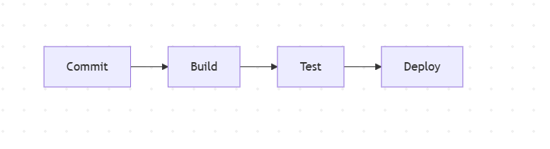

Stwórz prosty diagram Mermaid pokazujący proces CI/CD: commit → build → test → deploy.

Oczywiście! Oto prosty diagram Mermaid przedstawiający proces CI/CD:

flowchart LR
    A[Commit] --> B[Build]
    B --> C[Test]
    C --> D[Deploy]

Możesz wkleić ten kod do edytora obsługującego Mermaid (np. w Markdown na GitHubie lub w narzędziach typu Mermaid Live Editor), aby zobaczyć graficzny diagram.

